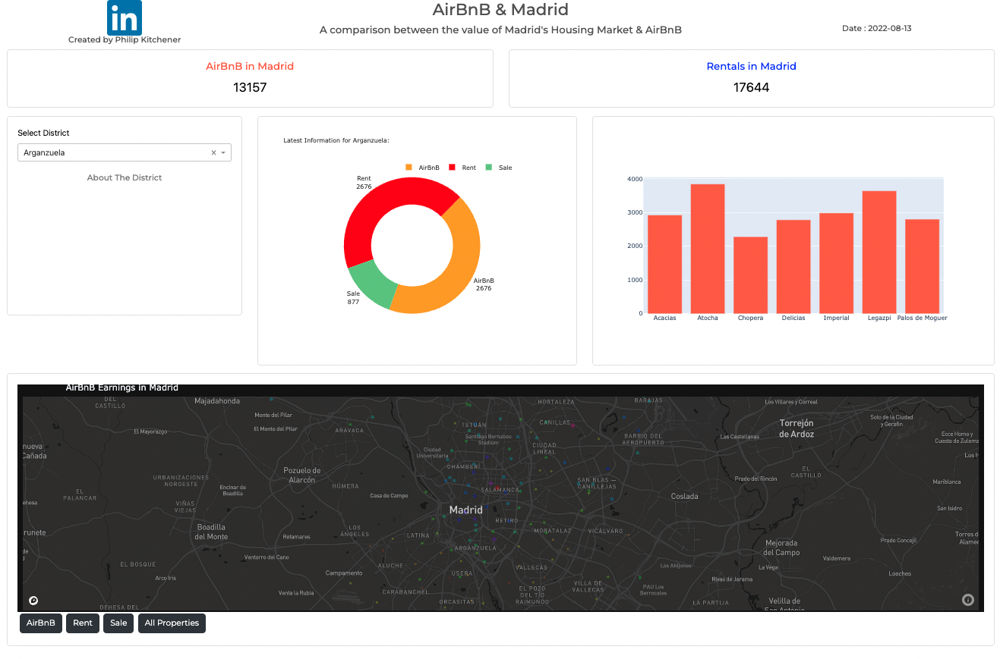
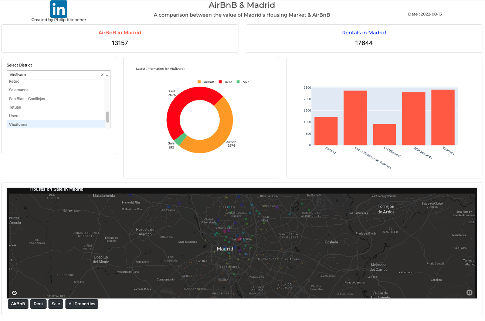

## Madrid Housing
A project about the Madrid Housing market, monthly rental income against Airbnb income. 

## Motivation
I wanted to look at the difference between the benefits of buying to let, airbnb or sell on.

This also has culiminated with the Dashboard, which will allow me to monitor the details in each neighbourhood of Madrid, grouped by their districts. 

## Code style
This notebook uses:

- Python
- SQL
- Dash

*Many of the datasets were very large, so was unable to upload to github. If you would like the necessary datasets, please contact me*

## Dash Photos

**The Donut and Bar graphs change upon selecting the district from the dropdown menu. The donut outlining the type of properties on the market and bar graph showing the mean monthly intake for each neighbourhood within the district**

## Credits
Data was sourced from:

**Inside Airbnb** *Calendar, Listing information*
http://insideairbnb.com/get-the-data

**EnriqueSPR's Investigation one the Rental Market in Madrid on Github**
https://github.com/EnriqueSPR/house_renting_madrid/blob/master/scrapping/rent_scrapper_all.csv

**Alvaro Villa Dangos' investigation on the Madrid housing market on Kaggle**
https://www.kaggle.com/datasets/alvarovilladangos/madrid-house-rent
